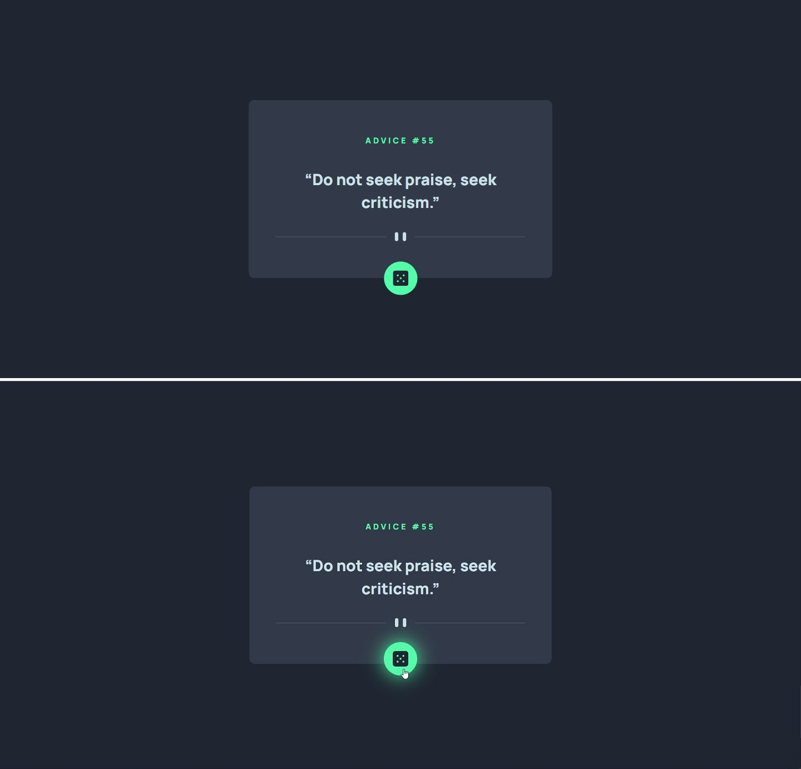
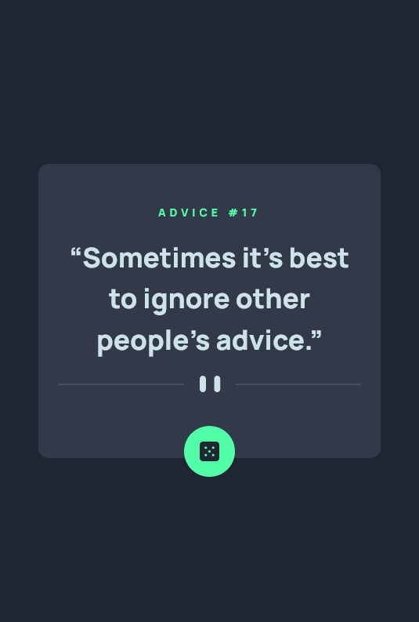

# Frontend Mentor - Advice generator app solution

This is a solution to the [Advice generator app challenge on Frontend Mentor](https://www.frontendmentor.io/challenges/advice-generator-app-QdUG-13db). Frontend Mentor challenges help you improve your coding skills by building realistic projects.

## Table of contents

- [Overview](#overview)
  - [The challenge](#the-challenge)
  - [Screenshot](#screenshot)
  - [Links](#links)
- [My process](#my-process)
  - [Built with](#built-with)
  - [What I learned](#what-i-learned)
  - [Useful resources](#useful-resources)
- [Author](#author)


## Overview


### The challenge

Users should be able to:

- View the optimal layout for the app depending on their device's screen size
- See hover states for all interactive elements on the page
- Generate a new piece of advice by clicking the dice icon

### Screenshot


---


### Links

- Solution URL: [Frontend Mentor](https://www.frontendmentor.io/solutions/advice-generator-app-with-api-6qqe6OkHW2)
- Live Site URL: [Github Pages](https://amrmabdelazeem.github.io/advice-generator-app/)

## My process

- Understand the Design: Analyze the layout, styling, and functionality required for the intro section and dropdown navigation.
- Create the HTML structure, use appropriate HTML elements, and make sure to include all necessary classes and IDs.
- Apply mobile-first approch.
- Apply the styles to achieve the layout and appearance described in the design.
- Use CSS Flexbox and position to control elements layout as needed.
- Implement responsive design to ensure the solution looks good on both mobiles (375px) and laptops (1440px).
- Research for the needed API to fetch it in the project.
- Use Javascript to call the API and add functionality through out the interface.
- Add Functionality to the dice icon to show and change advices.
- Build Laptop preview to fit the design using media queries and test it.
- Test the finish result.

## Bonus: Add animation to the dice to shake when hovered.


### Built with

- Semantic HTML5 markup
- CSS custom properties
- Flexbox
- Mobile-first workflow
- Responsive design
- JavaScript (E6)
- API
- Animation

### What I learned

This is the first project on frontend mentor using async await function:

```js
async function getApi(apiUrl){
    const response = await fetch(apiUrl);
    var data = await response.json();
}
```

### Useful resources

- [Advice API](https://api.adviceslip.com/) - This helped me get a random advice.

- [MDN Web Docs](https://developer.mozilla.org/en-US/docs/Web/API/Fetch_API/)

## Author

- Website - [Github](https://github.com/amrmabdelazeem)
- Frontend Mentor - [@amrmabdelazeem](https://www.frontendmentor.io/profile/amrmabdelazeem)